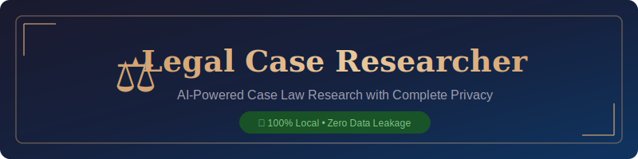
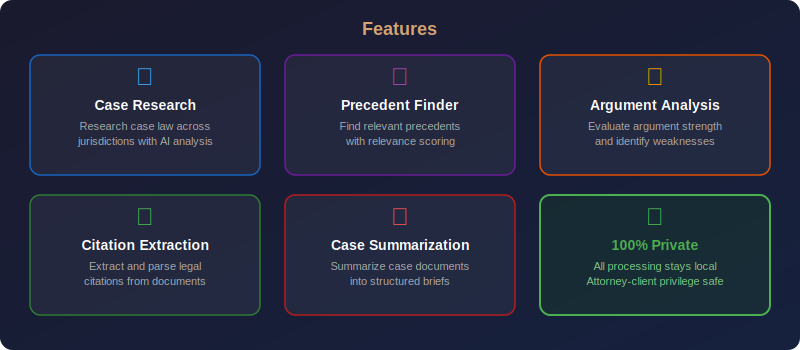

<p align="center">
  
</p>

<p align="center">
  
  
  
  
  
  
  
</p>

<h3 align="center">🔒 100% Local • Zero Data Leakage • Attorney-Client Privilege Protected</h3>

---

> **⚠️ LEGAL DISCLAIMER:** This tool is for research assistance only. It does NOT provide legal advice. All results should be verified by a qualified attorney. AI-generated analysis may contain inaccuracies. Always consult primary legal sources and confirm citations independently.

---

## 🔒 Privacy Notice

**Legal Case Researcher** runs entirely on your local machine using [Ollama](https://ollama.ai/) and [Gemma 4](https://ai.google.dev/gemma). No data — case documents, research queries, legal arguments, or any other information — is ever transmitted to external servers. This makes it suitable for environments where **attorney-client privilege** and **data confidentiality** are paramount.

- ✅ All LLM inference happens locally via Ollama
- ✅ No API keys, cloud accounts, or internet required for analysis
- ✅ No telemetry, analytics, or usage tracking
- ✅ Safe for privileged and confidential legal materials
- ✅ Compliant with data residency requirements

---

## 📑 Table of Contents

- [Features](#-features)
- [Architecture](#-architecture)
- [Quick Start](#-quick-start)
- [Docker Deployment](#-docker-deployment)
- [CLI Usage](#-cli-usage)
- [Web UI](#-web-ui)
- [API Documentation](#-api-documentation)
- [Configuration](#-configuration)
- [Testing](#-testing)
- [Project Structure](#-project-structure)
- [Privacy & Security](#-privacy--security)
- [Legal Disclaimer](#-legal-disclaimer)
- [Contributing](#-contributing)
- [License](#-license)
- [Acknowledgments](#-acknowledgments)

---

## ✨ Features

<p align="center">
  
</p>

### 🔍 Case Law Research
Research relevant case law across multiple jurisdictions. Get structured results with case names, citations, holdings, and legal principles — all analyzed by AI.

### 📚 Precedent Finder
Provide your case facts and legal issue and get back relevant precedents with relevance scoring, factual similarity analysis, distinguishing factors, and strategic recommendations.

### 📋 Argument Analysis
Submit a legal argument and receive a comprehensive assessment of its strength (strong/moderate/weak), supporting points, weaknesses, counter-arguments, and suggested improvements.

### 📎 Citation Extraction
Upload or paste legal text and automatically extract all case citations in proper Bluebook format, with court information and key holdings.

### 📄 Case Summarization
Summarize full case opinions into structured briefs — facts, issues, holdings, reasoning, significance, and key quotes extracted automatically.

### 🔒 100% Private
Every feature runs locally. No cloud, no API keys, no data leakage. Your confidential legal materials never leave the machine.

---

## 🏗️ Architecture

<p align="center">
  
</p>

The system follows a layered architecture:

| Layer | Component | Description |
|-------|-----------|-------------|
| **Interface** | CLI, Web UI, REST API | Multiple ways to interact with the system |
| **Core Engine** | `core.py` | All research logic, prompt engineering, JSON parsing |
| **LLM Client** | `common/llm_client.py` | Shared Ollama/Gemma 4 communication layer |
| **Inference** | Ollama + Gemma 4 | Local LLM inference — no external calls |

---

## 🚀 Quick Start

### Prerequisites

1. **Python 3.9+** installed
2. **Ollama** installed and running ([Install Ollama](https://ollama.ai/))
3. **Gemma 4** model pulled

```bash
# Install Ollama (if not already installed)
# Visit https://ollama.ai/ for platform-specific instructions

# Pull Gemma 4
ollama pull gemma4

# Verify Ollama is running
ollama list
```

### Installation

```bash
# Clone the repository
git clone https://github.com/kennedyraju55/90-local-llm-projects.git
cd 90-local-llm-projects/92-legal-case-researcher

# Install dependencies
pip install -r requirements.txt

# Verify installation
python -c "from src.case_researcher.core import research_case_law; print('✅ Ready')"
```

### Quick Test

```bash
# Run the test suite (no Ollama needed — tests use mocked LLM)
python -m pytest tests/ -v
```

### First Research Query

```bash
# CLI — research a legal question
python -m src.case_researcher.cli research "What constitutes a material breach of contract?"

# Or launch the web UI
streamlit run src/case_researcher/web_ui.py
```

---

## 🐳 Docker Deployment

### Docker Compose (Recommended)

The easiest way to run everything — app, API, and Ollama — in containers:

```bash
# Build and start all services
docker-compose up --build

# Services:
#   Web UI:  http://localhost:8501
#   API:     http://localhost:8000/docs
#   Ollama:  http://localhost:11434
```

### Standalone Docker

```bash
# Build the image
docker build -t legal-case-researcher .

# Run (assumes Ollama is running on host)
docker run -p 8501:8501 \
  -e OLLAMA_HOST=http://host.docker.internal:11434 \
  legal-case-researcher
```

---

## 💻 CLI Usage

The CLI provides rich, formatted output using Click and Rich.

### Research Case Law

```bash
# Basic research
python -m src.case_researcher.cli research "What is the standard for summary judgment?"

# With jurisdiction filter
python -m src.case_researcher.cli research "Employment discrimination under Title VII" -j federal

# With specific model
python -m src.case_researcher.cli research "Patent eligibility after Alice" -m gemma4:latest
```

### Find Precedents

```bash
python -m src.case_researcher.cli precedents \
  --facts "Tenant was evicted without prior notice or hearing" \
  --issue "Due process requirements in eviction proceedings"
```

### Analyze an Argument

```bash
python -m src.case_researcher.cli analyze \
  "The non-compete clause is unenforceable because it lacks adequate consideration and is overly broad in geographic and temporal scope."
```

### Extract Citations

```bash
# Extract citations from a file
python -m src.case_researcher.cli citations path/to/legal_brief.txt
```

### Summarize a Case

```bash
# Summarize a case document
python -m src.case_researcher.cli summarize path/to/case_opinion.txt
```

### View Sample Scenarios

```bash
python -m src.case_researcher.cli samples
```

### Show Disclaimer

```bash
python -m src.case_researcher.cli disclaimer
```

---

## 🌐 Web UI

Launch the Streamlit web interface for an interactive browser-based experience:

```bash
streamlit run src/case_researcher/web_ui.py --server.port 8501
```

Then open **http://localhost:8501** in your browser.

### Web UI Features

- **🔍 Case Research** — Enter a legal question, select jurisdiction, get structured results
- **📚 Find Precedents** — Describe case facts and legal issue, find relevant precedents
- **📋 Analyze Argument** — Paste an argument, get strength assessment with metrics
- **📄 Summarize Case** — Upload or paste a case document for AI summarization
- **Sidebar** — Model selection, jurisdiction filter, sample scenario loader
- **Dark Theme** — Professional dark interface with legal gold accents
- **Privacy Badge** — Always-visible indicator that data stays local

---

## 📡 API Documentation

Start the FastAPI server:

```bash
uvicorn src.case_researcher.api:app --host 0.0.0.0 --port 8000
```

Interactive API docs available at **http://localhost:8000/docs** (Swagger UI) and **http://localhost:8000/redoc** (ReDoc).

### Endpoints

| Method | Endpoint | Description |
|--------|----------|-------------|
| `GET` | `/health` | Health check — API and Ollama status |
| `POST` | `/research` | Research case law |
| `POST` | `/precedents` | Find legal precedents |
| `POST` | `/analyze` | Analyze legal argument strength |
| `POST` | `/citations` | Extract case citations from text |
| `POST` | `/summarize` | Summarize a case document |
| `GET` | `/samples` | Get sample research scenarios |

### Example Requests

#### Health Check

```bash
curl http://localhost:8000/health
```

```json
{
  "status": "healthy",
  "ollama_running": true,
  "version": "1.0.0"
}
```

#### Research Case Law

```bash
curl -X POST http://localhost:8000/research \
  -H "Content-Type: application/json" \
  -d '{
    "query": "What constitutes a material breach of contract?",
    "jurisdiction": "federal",
    "model": "gemma4:latest"
  }'
```

#### Find Precedents

```bash
curl -X POST http://localhost:8000/precedents \
  -H "Content-Type: application/json" \
  -d '{
    "case_facts": "Employee was passed over for promotion despite superior qualifications",
    "legal_issue": "Employment discrimination under Title VII",
    "model": "gemma4:latest"
  }'
```

#### Analyze Argument

```bash
curl -X POST http://localhost:8000/analyze \
  -H "Content-Type: application/json" \
  -d '{
    "argument": "The statute of limitations has expired, barring the plaintiffs claim entirely.",
    "model": "gemma4:latest"
  }'
```

#### Extract Citations

```bash
curl -X POST http://localhost:8000/citations \
  -H "Content-Type: application/json" \
  -d '{
    "text": "As established in Brown v. Board of Education, 347 U.S. 483 (1954), separate educational facilities are inherently unequal.",
    "model": "gemma4:latest"
  }'
```

#### Summarize Case

```bash
curl -X POST http://localhost:8000/summarize \
  -H "Content-Type: application/json" \
  -d '{
    "case_text": "Miranda v. Arizona, 384 U.S. 436 (1966). The Supreme Court held that statements made during custodial interrogation are inadmissible unless the defendant was informed of their rights...",
    "model": "gemma4:latest"
  }'
```

#### Get Samples

```bash
curl http://localhost:8000/samples
```

---

## ⚙️ Configuration

### config.yaml

```yaml
app:
  name: "Legal Case Researcher"
  version: "1.0.0"
llm:
  model: "gemma4:latest"
  temperature: 0.3
  max_tokens: 4096
  ollama_host: "http://localhost:11434"
research:
  default_jurisdiction: "federal"
  max_results: 10
logging:
  level: "INFO"
  format: "%(asctime)s - %(name)s - %(levelname)s - %(message)s"
```

### Environment Variables

| Variable | Default | Description |
|----------|---------|-------------|
| `OLLAMA_HOST` | `http://localhost:11434` | Ollama server URL |
| `OLLAMA_MODEL` | `gemma4:latest` | Default model |
| `LOG_LEVEL` | `INFO` | Logging level |
| `API_HOST` | `0.0.0.0` | API bind address |
| `API_PORT` | `8000` | API port |
| `STREAMLIT_PORT` | `8501` | Web UI port |

Environment variables override config.yaml values.

---

## 🧪 Testing

```bash
# Run all tests
python -m pytest tests/ -v

# Run with coverage
python -m pytest tests/ -v --tb=short

# Run specific test class
python -m pytest tests/test_core.py::TestResearchCaseLaw -v

# Run specific test
python -m pytest tests/test_core.py::TestParseJsonResponse::test_valid_json -v
```

Tests use mocked LLM responses — **no Ollama required** to run the test suite.

### Test Coverage

| Module | Tests | Description |
|--------|-------|-------------|
| `test_core.py` | 20+ | JSON parsing, all core functions, helpers, data structures |

---

## 📁 Project Structure

```
92-legal-case-researcher/
├── src/case_researcher/        # Main application package
│   ├── __init__.py             # Package init with version
│   ├── core.py                 # Core research engine
│   ├── cli.py                  # CLI interface (Click + Rich)
│   ├── web_ui.py               # Web interface (Streamlit)
│   ├── api.py                  # REST API (FastAPI)
│   └── config.py               # Configuration management
├── tests/
│   └── test_core.py            # Test suite with mocked LLM
├── examples/
│   ├── demo.py                 # Demo script
│   └── README.md               # Usage examples
├── docs/images/
│   ├── banner.svg              # Project banner
│   ├── architecture.svg        # Architecture diagram
│   └── features.svg            # Features overview
├── .github/workflows/
│   └── ci.yml                  # GitHub Actions CI
├── common/
│   ├── __init__.py             # Common package init
│   └── llm_client.py           # Shared Ollama client
├── config.yaml                 # Application configuration
├── setup.py                    # Package setup
├── requirements.txt            # Python dependencies
├── Makefile                    # Build targets
├── Dockerfile                  # Container image
├── docker-compose.yml          # Multi-service deployment
├── .dockerignore               # Docker build exclusions
├── .env.example                # Environment template
├── README.md                   # This file
├── CONTRIBUTING.md             # Contribution guidelines
└── CHANGELOG.md                # Version history
```

---

## 🔒 Privacy & Security

Legal Case Researcher was designed from the ground up with privacy as its core principle. This is critical for legal professionals handling privileged and confidential information.

### How Privacy is Maintained

| Aspect | Implementation |
|--------|---------------|
| **LLM Inference** | Runs locally via Ollama — no API calls to OpenAI, Google, or any cloud provider |
| **Data Storage** | No data is persisted beyond the current session (unless you explicitly save output) |
| **Network Access** | The application only communicates with `localhost:11434` (Ollama). Zero external network calls. |
| **Telemetry** | None. No analytics, no usage tracking, no error reporting to external services. |
| **Audit Trail** | All processing is transparent and inspectable in the source code. |

### Recommended Security Practices

1. **Run on an air-gapped machine** for the most sensitive work
2. **Use disk encryption** (BitLocker, FileVault, LUKS) on the machine running this tool
3. **Do not expose the API** to untrusted networks — bind to `127.0.0.1` in production
4. **Review outputs carefully** — AI can hallucinate case citations and holdings
5. **Keep Ollama updated** to benefit from security patches

### Compliance Considerations

- ✅ **GDPR** — No personal data is transmitted externally
- ✅ **HIPAA** — Suitable for processing medical-legal records locally
- ✅ **Attorney-Client Privilege** — No third-party access to queries or results
- ✅ **Data Residency** — All data remains on the local machine

---

## ⚠️ Legal Disclaimer

**This tool is for research assistance only.**

- It does **NOT** provide legal advice
- All results should be verified by a qualified attorney
- AI-generated analysis may contain **inaccuracies**, including fabricated case citations
- Always consult **primary legal sources** and confirm citations independently
- The developers assume no liability for decisions made based on this tool's output
- This tool is not a substitute for professional legal judgment or a licensed attorney

**By using this software, you acknowledge that:**
1. You understand the limitations of AI-generated legal research
2. You will independently verify all case citations, holdings, and legal principles
3. You will not rely solely on this tool for legal decision-making
4. The tool's output does not constitute legal advice

---

## 🤝 Contributing

Contributions are welcome! Please see [CONTRIBUTING.md](CONTRIBUTING.md) for guidelines.

1. Fork the repository
2. Create a feature branch (`git checkout -b feature/improvement`)
3. Make your changes with tests
4. Run `python -m pytest tests/ -v` to verify
5. Submit a pull request

---

## 📄 License

This project is licensed under the **MIT License**. See the repository root for the full license text.

---

## 🙏 Acknowledgments

- **[Ollama](https://ollama.ai/)** — Local LLM inference engine
- **[Google Gemma 4](https://ai.google.dev/gemma)** — Open-weight language model
- **[Streamlit](https://streamlit.io/)** — Web UI framework
- **[FastAPI](https://fastapi.tiangolo.com/)** — Modern API framework
- **[Click](https://click.palletsprojects.com/)** — CLI framework
- **[Rich](https://rich.readthedocs.io/)** — Beautiful terminal formatting

---

<p align="center">
  <strong>⚖️ Legal Case Researcher</strong><br/>
  <em>AI-powered legal research with complete privacy</em><br/>
  <br/>
  Part of <a href="https://github.com/kennedyraju55/90-local-llm-projects">90 Local LLM Projects</a><br/>
  Built with ❤️ by <a href="https://github.com/kennedyraju55">Nrk Raju Guthikonda</a>
</p>
